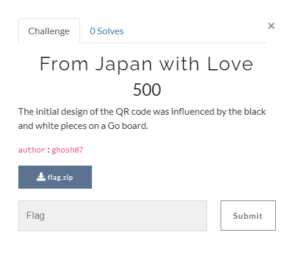
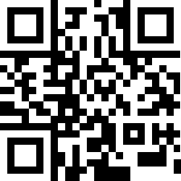

# From Japan with Love



### Challenge:
##### The initial design of the QR code was influenced by the black and white pieces on a Go board.
##### 500 Points
##### Files: [flag.zip](flag.zip)

### Solve:

The provided .zip contained a single **flag.mp4** which was not playable. Opening the file in a hex editor revieled that it reselmbled a PNG file, however the header was corrupted. I copied the PNG header from a random screen capture I had lying and overwrote the corrupted header, then renamed the file with a **.png** file extension. This gave me the image below:


Using an online [QR code decoder](https://zxing.org/w/decode.jspx) tool, I was able read the content.

Finally, the flag!


```
GLUG{S33ms_l1k3_th3_wr0n9_fl49}
```

Hmmm, seems suspecious. Turns out this ISN'T the flag I'm looking for, and that I have more digging to do!

The clue references the tabletop game **Go** where colours are flipped (though I don't really know the rules to Go). I tried inverting the QR code in hopes that it would provide something useful.



Sadly this didn't yield any results.

### Flag
```
GLUG{S33ms_l1k3_th3_wr0n9_fl49} <--- Red Herring!

TBD
```
