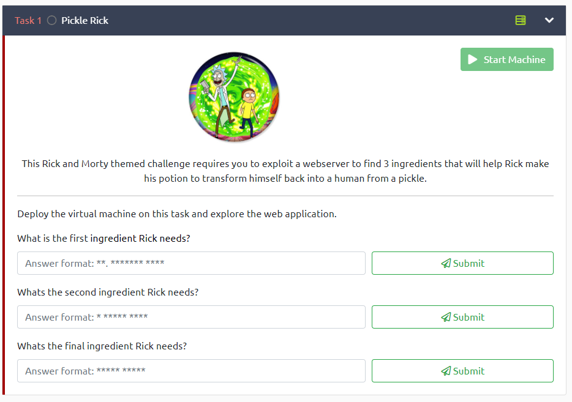

[< Back to All CTFs](https://github.com/KrisLloyd/Python/tree/master/CTF#ctf-solves)

[< Back to AE CTF](https://github.com/KrisLloyd/Python/tree/master/CTF#ae-ctf---tryhackme-april-2021)
***

# Pickle Rick



### Challenge:
##### This Rick and Morty themed challenge requires you to exploit a webserver to find 3 ingredients that will help Rick make his potion to transform himself back into a human from a pickle.
##### 90 Points Total, 30 per question

### Solve:


```bash
root@ip-10-10-150-158:~# gobuster dir -u http://10.10.117.3 -w /root/Desktop/Tools/wordlists/dirb/common.txt 
===============================================================
Gobuster v3.0.1
by OJ Reeves (@TheColonial) & Christian Mehlmauer (@_FireFart_)
===============================================================
[+] Url:            http://10.10.117.3
[+] Threads:        10
[+] Wordlist:       /root/Desktop/Tools/wordlists/dirb/common.txt
[+] Status codes:   200,204,301,302,307,401,403
[+] User Agent:     gobuster/3.0.1
[+] Timeout:        10s
===============================================================
2021/04/21 15:19:50 Starting gobuster
===============================================================
/.hta (Status: 403)
/.htaccess (Status: 403)
/.htpasswd (Status: 403)
/assets (Status: 301)
/index.html (Status: 200)
/robots.txt (Status: 200)
/server-status (Status: 403)
===============================================================
2021/04/21 15:19:50 Finished
===============================================================
```


### Flag
```
flag{not_so_stealthy_exfil}
```


