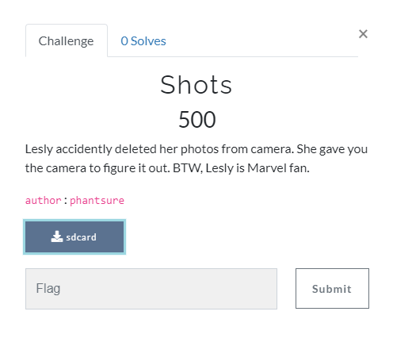

# Shots



### Challenge:
##### Lesly accidently deleted her photos from camera. She gave you the camera to figure it out. BTW, Lesly is Marvel fan.
##### 500 Points
##### Files: [sdcard](sdcard)

### Solve:

The file that comes with the challenge does not have an extension provided, however from context I was able to determine that it should be an **.iso** file. Addiing this extension to the file allowed me to open the archive using 7zip and explore the filesystem.

Insize the archive there were 2 folders, **lost+found** and **[SYS]**. Inside the [SYS] folder was a single file **Journal**.

[Journal](Journal)

Opening the Journal file in a hex editor showed that the file has the signiture **0xc03b3998** showing that it is an Ext3 filesystem journal. Knowing what I'm dealing with, I can use this to attempt to recover the deleted files.

There is an article [Restoring Deleted Files in Linux from the ext3 Journal](https://spin.atomicobject.com/2012/06/29/restoring-deleted-files-from-the-ext3-journal/) that outlines the process to recover deleted files. I will attempt this strategy next.

Returning to the **sdcard** file, I was able to use the **formost** program in Kali to recover lost some files. The program was able to recover 2 folders **jpg** and **png**, inside I found the following:

```
foremost -i sdcard
```

```
/jpg
- 00002730.jpg
- 00003136.jpg
- 00003280.jpg
- 00003650.jpg
- 00004728.jpg
- 00012290.jpg
- 00014338.jpg
- 00015048.jpg
- 00015874.jpg

/png
- 000048323.png
```

I loaded some images into [StegOnline](https://stegonline.georgeom.net/) and did some initial browsing of the colour planes and the bit planes. From the few files I looked at, there was no hidden information that was visible. 

My new working theory is the filenames.


- Side note - 

Exploring the challenge creators GitHub, I also discovered a CTF repository that contained a 'Stego' folder with a single image.


It may or may not be related, and this is most likely not the intended path, however I cannot discount the reference to Marvel in the provided clue. 

More investigation needs to be done for this solve.

### Flag
```
TBD
```
