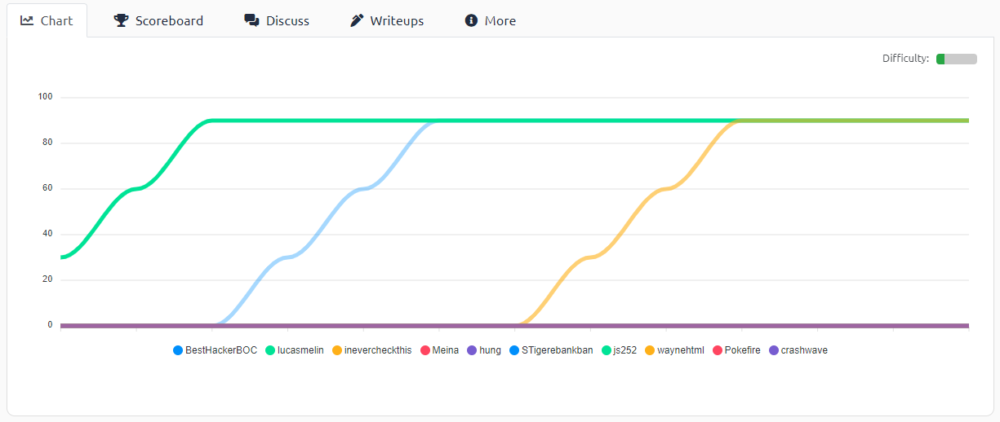

[< Back to About](https://github.com/KrisLloyd/About#about)
***

# CTF Solves

### BIT Olymipcs (March 2021)

#### [ Results ]

* TeamK - 1200 Points (1 member)

#### [ Reverse Engineering ]

* [Ropes](./Ropes)

#### [ PWN ]

* [Overflow-0](./Overflow0)

#### [ Misc ]

* [What is Docx?](./Docx)
* [What's the code?](./WhatsTheCode)
* [Exfil](./Exfil)

#### [ Web ]

* [Sauce?](./Sauce)

#### [ Crypto ]

* [My first riot](./Riot)
* [My ex or me](./ExOrMe)
* [My Second Rot-i](./ROT-i)

### FooBar CTF (March 2021)

#### [ Misc ]
* [From Japan with Love](./Japan)

#### [ Forensics/Steg ]
* [Shots](./Shots)
* [Render](./Render)

### AE CTF - TryHackMe (April 2021)

* [Pickle Rick](./PickleRick)
