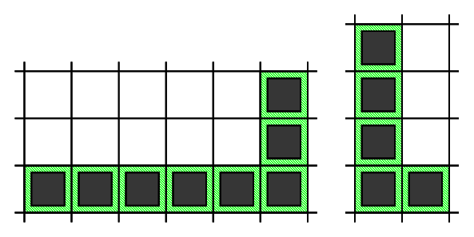
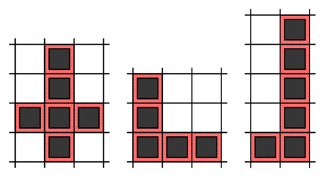

[< Back to Python Projects](https://github.com/KrisLloyd/Python#python)

[< Back to Google Kick Start](https://github.com/KrisLloyd/Python/tree/master/GKS#aboutt)
***

# Problem

Given a grid of **R** rows and **C** columns each cell in the grid is either **0** or **1**.

A segment is a nonempty sequence of consecutive cells such that all cells are in the same row or the same column. We define the length of a segment as number of cells in the sequence.

A segment is called "good" if all the cells in the segment contain only **1s**.

An "L-shape" is defined as an unordered pair of segments, which has all the following properties:

* Each of the segments must be a "good" segment.
* The two segments must be perpendicular to each other.
* The segments must share one cell that is an endpoint of both segments.
* Segments must have length at least **2**.
* The length of the longer segment is twice the length of the shorter segment.
* We need to count the number of L-shapes in the grid.

Below you can find two examples of correct L-shapes,

and three examples of **invalid** L-shapes.

### Input

The first line of the input contains the number of test cases, **T**. **T** test cases follow.

The first line of each testcase contains two integers **R** and **C**.

Then, **R** lines follow, each line with **C** integers representing the cells of the grid.

### Output

For each test case, output one line containing Case #x: y, where x is the test case number (starting from 1) and y is the number of L-shapes.

### Limits
Time limit: 60 seconds.

Memory limit: 1 GB.

1≤T≤100.

Grid consists of 0s and 1s only.

### Test Set 1
1≤R≤40.

1≤C≤40.

1≤N≤100.

### Test Set 2
1≤R≤1000 and 1≤C≤1000 for at most 5 test cases.

For the remaining cases, 1≤R≤40 and 1≤C≤40.

# Solution

[LPlots.py](./LPlots.py)
