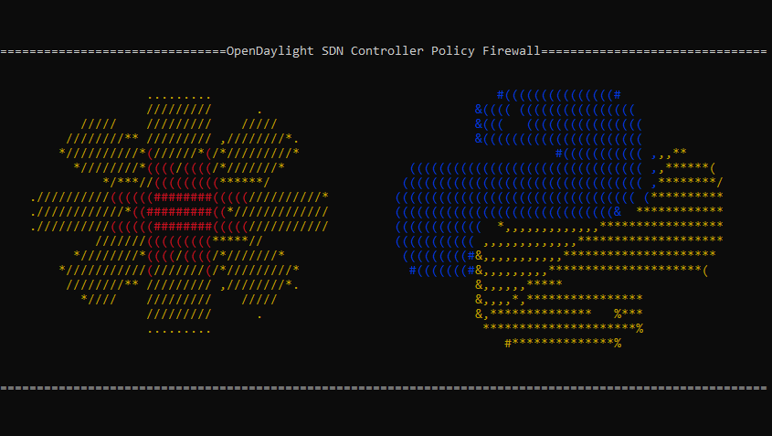
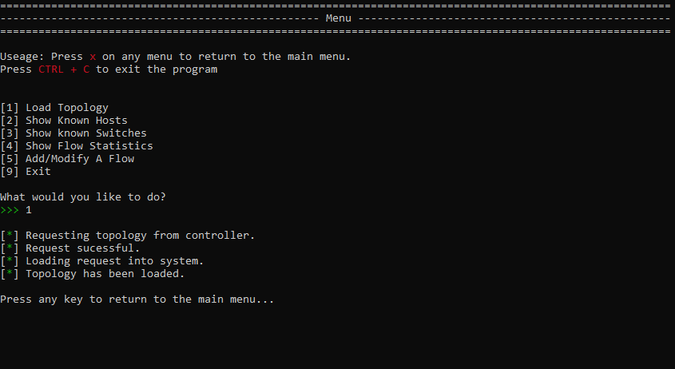
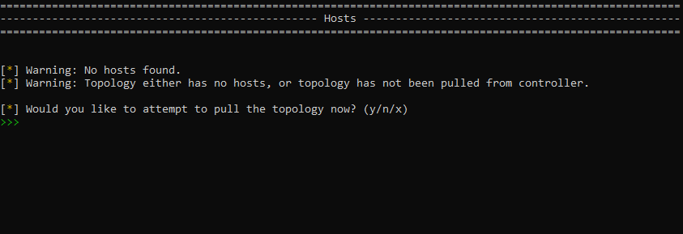
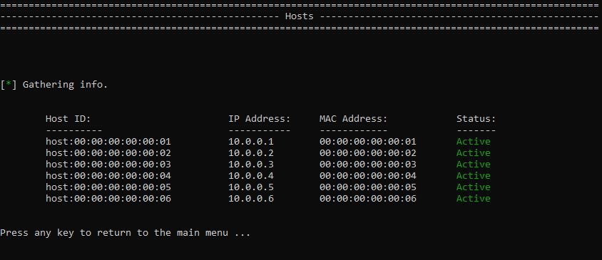
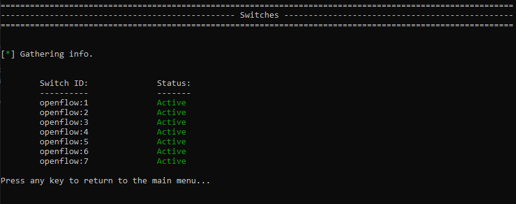
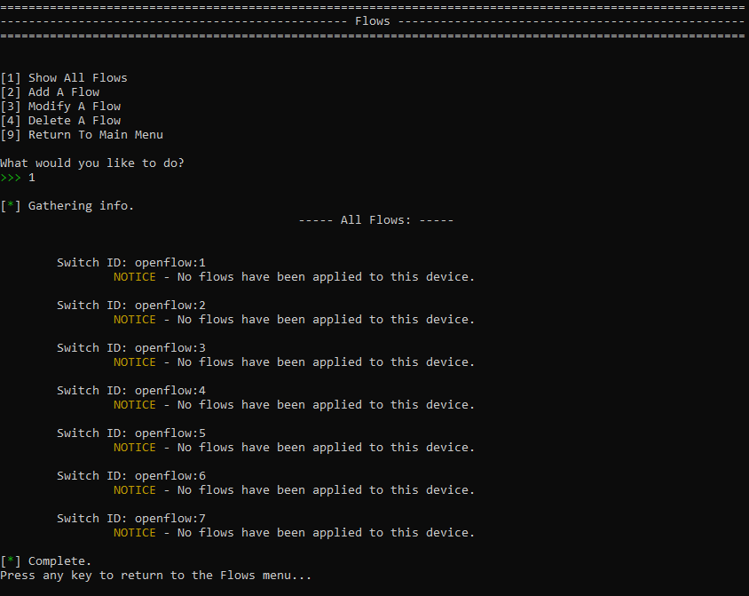
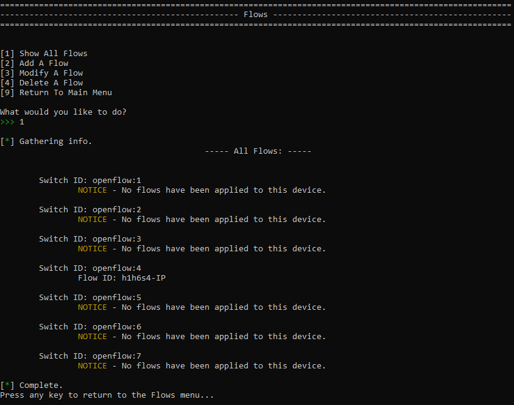

[< Back to Python Projects](https://github.com/KrisLloyd/Python#python)
***

# About
Program that uses REST APIs to interact with the OpenDaylight SDN controller to implement forwarding policy.

# Useage

This program is intended to be run from the command line.

```bash
./policy-controller.py
```

The program allows an anministrator to connect to an OpenDaylight SDN controller and interact using REST APIs to query and make changes to the operational and config datastores.

When the program loads, the user will be greeted by the splash screen:



When the program loads, the user will have a menu of options. In order to ensure the program is connected to the controller, test by loading the topology from the controller by selecting option 1:



From this point, the user can show known hosts and switches, check current flow statistics, and check/add/modify/delete flow rules.

<br></br>
# Examples

* Show known hosts:

  When no hosts are known, the user will be prompted to perform a scan of the topology
  
  
  When hosts are known to the program, they will be shown similar to the output below:
  

* Show known switches:
 
  

* Show flows:

  When no flows have been configured, the output will resemble the following:
  
  
  When there are configured flow rules, they will be shown on a per switch basis:
  
